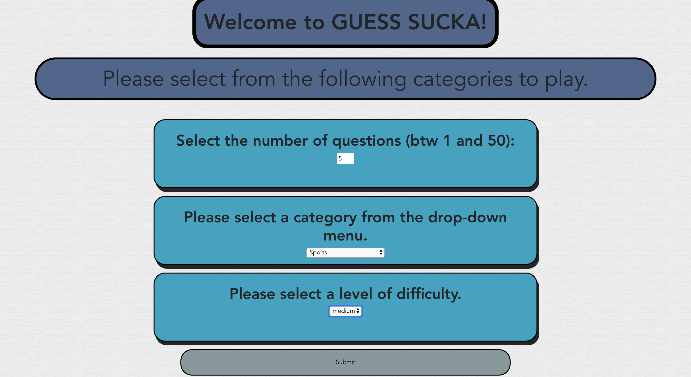
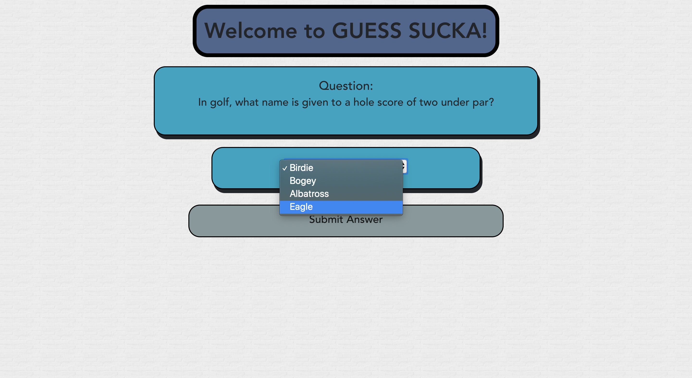
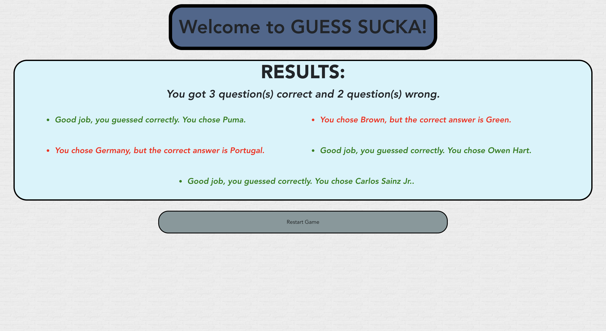

### Guess_Sucka

This was part of a group project. Assisted in building a multiple choice game using Vue.js, see below. 

Allows you to select the number of questions, category and difficulty. 

Read the question and select the answer. 

Your results are displayed, showing the number of correct / incorrect answers. In addition, the correct answers are in green and incorrect are in red. 

### Let's connect. 
[LinkedIn Profile](https://www.linkedin.com/in/jamal-numan/).
